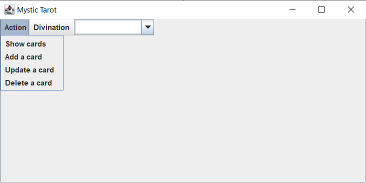

# Mystic tarot

### _Introduction_

The objective of this project is to create an application with the graphic interface that will let us manage our  divinatory tarot cards. This application is a fortune-teller game but it also allows a user to add, update, delete and consult his cards.

### _Application structure_

One card has three properties: title, description and image. They are defined in the **Card** class.

To add principal functionalities like adding, modifying, consulting and deleting a card and make them inherited from an abstract **Action** class as it is mentioned in the instructions provided by school I created a **Deck** class which extends the abstract **Action** class and created the functions corresponding to the necessary actions.

To add a card and to be able to save it in  json format I checked out the links provided in the instructions and followed the tutorials. The goal was to create a file every time a user adds a new card.

To be able to consult a card I created the function **showCards()** which loops through the files that the user added and returns them as cards. The return value of this function is used in all manipulations with the cards. The manipulation with the cards means to manipulate with the files. Everytime the user updates or deletes a card files are being modified as well.

### _Graphic interface_

To design the user interface I used Java Swing which is a lightweight GUI toolkit. I made a **UserInterface** class which includes all the components that should be added to the interface.
It consists of a menu and searchfield. Each of the menu items calls the corresponding function on the click. When consulting the cards, users can see their images and descriptions. (NOTE:You have to enlarge or reduce the window to see the result).

 

To be able to add ActionListeners to menu items I used a **HashMap** class as it was directed.

To add, update and delete a card I decided to use a small dialog box. I inspired myself from an example that I found from the internet and created a confirm box inside a **CardPanel** class. For searchfield i just used the **JComboBox** the implementation of which is explained in the tutorial. The user can search the cards by their titles.

### _Fortune telling_

This part is not fully implemented. When a user clicks on a card he can see the description of the card but the idea was to show 3 cards with their images and descriptions after the user clicks on three cards. So the user can only choose three cards and the first card for example points to the current situation, the second can give some advice or warn about something and the third one shows the future. Of course there must be a shuffle function which changes the cards position. Unfortunately I haven’t finished it. 
